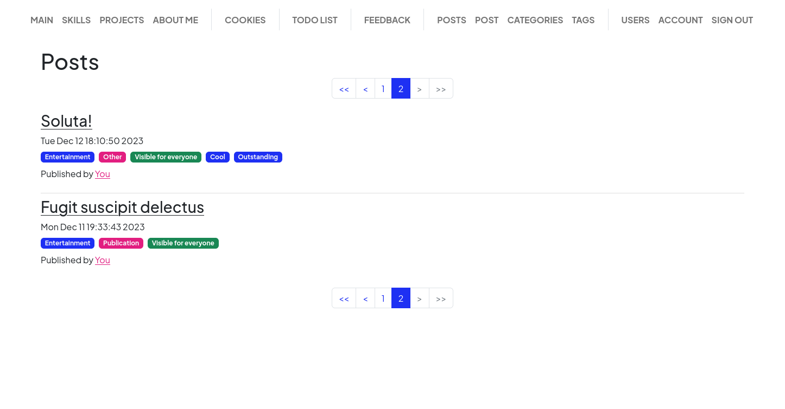
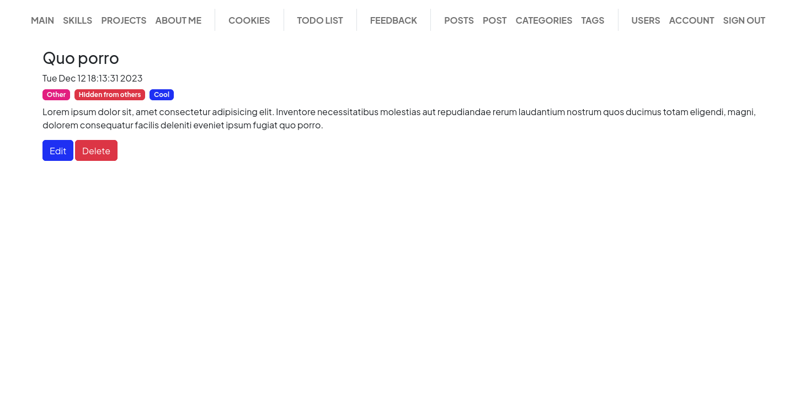
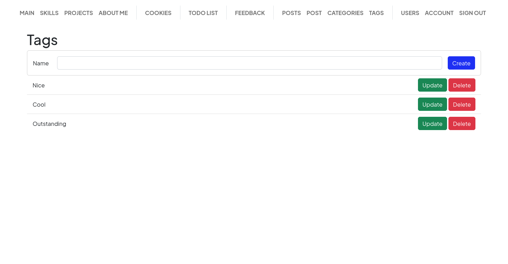

# Лабораторна робота №11

## Список постів (`/post`, `/post/list`)

### Для неавторизованого користувача (бачить всі публічні пости)
.png)

### Для авторизованого користувача (бачить всі публічні і свої приватні пости)

## Пост (`/post/<int:id>`)

### Для неавторизованого користувача
.png)

### Для авторизованого користувачапости)

## Створення посту (`/post/create`)

## Редагування посту (`/post/<int:id>/update`)

## Підтвердження видалення посту (`/post/<int:id>/delete`)

## Список категорів (`/post/categories`, `/post/categories/list`)

### Для неавторизованого користувача (бачить всі категорії)
.png)

### Для авторизованого користувача (бачить всі категорії і може їх створювати/редагувати/видаляти)

## Редагування категорії (`/post/categories/<int:id>/update`)

## Список категорів (`/post/tags`, `/post/tags/list`)

### Для неавторизованого користувача (бачить всі теги)
.png)

### Для авторизованого користувача (бачить всі теги і може їх створювати/редагувати/видаляти)

## Редагування тегу (`/post/tags/<int:id>/update`)

