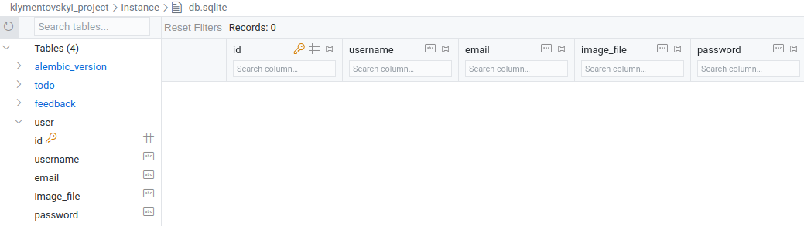

# Лабораторна робота №7

## Завдання 4. Створення таблиці `user`

### Таблиця `user` створена і не має даних.

### Чотири користувачі були додані до таблиці.

### Другий користувач був видалений. Перший користувач змінив пароль.

## Завдання 8. Реєстрація та авторизація

### Повідомлення про успішну реєстрацію

### Помилки валідації при спробі реєстрації

### Повідомлення про успішну авторизацію

### Помилка валідації при спробі авторизації

## Завдання 13

### Повідомлення про успішну реєстрацію

### Помилки при спробі повторної реєстрації існуючого користувача

